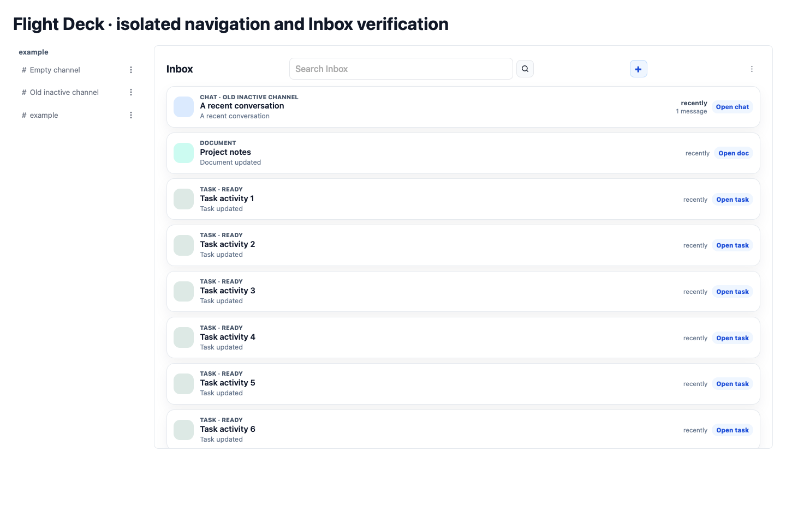
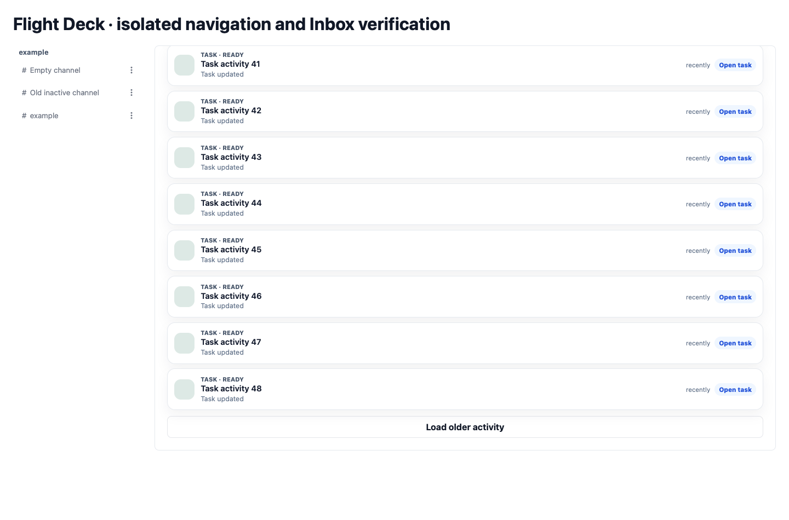

# Build 1876 Inbox and complete channel navigation — manager handoff

Task a808fbce-437d-4e06-ab49-881e43b86034 remains in_progress for manager review. No task mutation or external chat/comment post. Latest task comments were successfully read through the broker-aware CLI with the supplied Tower/workspace and repository app identity; the execution contract matches the direct instructions. Session e6673619-8967-41cd-9bb0-e3593bf296c0 has goal/reflect metadata during work.

## Diagnosis

Both supplied screenshots were inspected. The global “Load older cached activity” banner came from the performance change's separate source-window control. The existing Inbox footer only expanded already loaded cards. Those separate controls are now integrated in the Inbox footer.

Channels are not older Inbox content. Their unwindowed getChannelsByOwner workspace subscription is always on and the sidebar uses scopes/channels, not recent activity or Inbox windows. No current channel-code failure was reproduced, so no speculative channel or backend change was made. The prior FD1874 WebKit worker-entry duplication defect remains fixed by FD1875's inlineDynamicImports setting.

Read-only desktop evidence: PID 462 runs app/build/macos/Build/Products/Debug/wingman_app.app. Both that bundle's Flight Deck version.json and the actual http://127.0.0.1:47831/version.json report build 1868 / 20260902-0604-1-1868. The existing Flight Deck runtime http://127.0.0.1:41045 reported 1875 at intake and now serves 1876 after normal dist publication. The screenshot's banner was introduced after 1868, so the inspected loopback response alone cannot identify the screenshot tab's loaded origin, service worker or bundle. Do not claim the screenshot is proven to be 1874 or that the live desktop screen is fixed.

## Change and release

Flight Deck commit 8207b06, fix(inbox): load older activity from the Inbox footer, pushed normally to GitHub origin/main (4212ac7..8207b06). Build 1876 / 20260905-0749-5-1876, builtAt 2026-09-05T07:49:24.672Z.

- Initial Inbox window remains 50 mixed cards, preserving grouping, ordering and filtering.
- One bottom “Load older activity” button reveals up to 50 more cards. When loaded matches run short it expands each indexed source prefix by 50 once. Source hasMore keeps the button accessible for sparse/zero-match filters. There is no finite source-history cap and no scroll-driven or automatic drain.
- Files has its own “Load older files” footer, source limit and hasMore state. Workspace changes reset both sets of paging state. No global Deck banner remains.
- Channels retain their independent unwindowed subscription; deleted/unreadable records retain legitimate filters.

The existing WMapp bundle updater copied verified dist with --use-existing-dist. Tracked packaged assets and macOS/iOS Release embedded assets match dist byte-for-byte (19 files). Generated asset retirement follows the existing updater/build policy; no source cleanup or adjacent-service edits.

## Validation

- Focused Inbox/Dexie, overview and subscription regressions pass; full bun run test --maxWorkers=4: 251 files / 3425 tests pass. Tests cover initial50/next50, older bounded sources, empty filtered prefixes, exhaustion, Files isolation, workspace reset, independent old/inactive/empty channels, archive/access exclusion and footer placement. The former template assertion requiring scroll loading was updated to assert its removal.
- Release-note tests: 8 pass. bun run build, bun run verify:dist, git diff --check pass.
- bun run check:public-source was run before, after and with new files staged. It still fails with the same 107 pre-existing findings; reports are byte-identical. No bypass/checker modification. Public Flight Deck operational handoffs remain local and untracked; no private capture was committed.
- scripts/verify-inbox-navigation-browser.mjs uses actual built sidebar/Inbox markup, source Alpine projections and native Dexie liveQuery, plus the production materialization worker, via in-memory HTTP routing. No server/authentication/shared IndexedDB. Chrome 152.0.7977.76 and WebKit 18.4 pass, with zero page errors, initial50/next100, source expansion, 25 older filtered matches, exhaustion and no paging on scroll.
- WebKit replayed all 54 existing private captured pages through the corrected worker. All 31 canonical channels mapped to their exact canonical scope IDs in the real sidebar projection; the additional two test channels stayed present during paging. Private result /tmp/fd-inbox-canonical.log; private screenshots /tmp/flightdeck-inbox-canonical-private.png and -top.png. Captured records remain /tmp/fd1874-live-page-*.json, never published.
- Synthetic rendered screenshots from the macOS Release embedded bundle are included below. The browser test also passes against those assets. This is a rendered component harness, not the authenticated full WMapp screen.
- WMapp updater/source-resolution test passes. flutter test test/flight_deck_update_manager_test.dart test/status_screen_test.dart: 10 pass.
- flutter build macos --release succeeds, producing app/build/macos/Build/Products/Release/wingman_app.app. Build emitted an existing objective_c architecture framework-name warning but completed.
- ./build_ios_release.sh succeeds; app/build/ios/Release-iphoneos/Runner.app contains build1876 and codesign --verify --deep --strict passes.
- WebKit production-worker regressions pass against tracked WMapp assets and the signed iOS Release assets: first hydration, cached restart, cursor/fallback/reset guards, exactly one reply per request, and other sync-worker startup.

## Exact activation limits

No running app was restarted, no device installed/launched, no cache/auth/pending data wiped, no standalone server started, no backend changed. The running desktop Debug bundle is still1868; the new macOS Release is a separate prepared artifact. No OTA manifest was published or update applied. These Release commands use packaged-only defaults (WMAPP_FLIGHTDECK_OTA_ENABLED defaults false); the currently running app's exact compiled OTA settings and screenshot tab state were not inspected. Loopback currently serves1868, so no corrected OTA activation is evidenced there.

The actual screenshot tab URL/version/authentication and Pete-authenticated channel screen are unavailable to this worker. Physical iPhone acceptance was not attempted; prior handoff records it unavailable. Manager must choose activation of the prepared package and verify the real authenticated screen before claiming live success. Build/package/synthetic and canonical replay success do not substitute for that acceptance.
